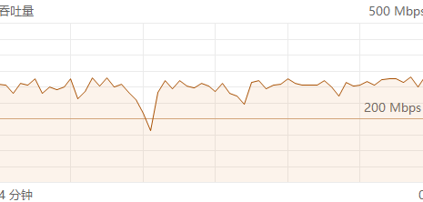
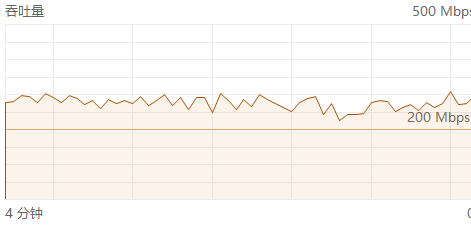
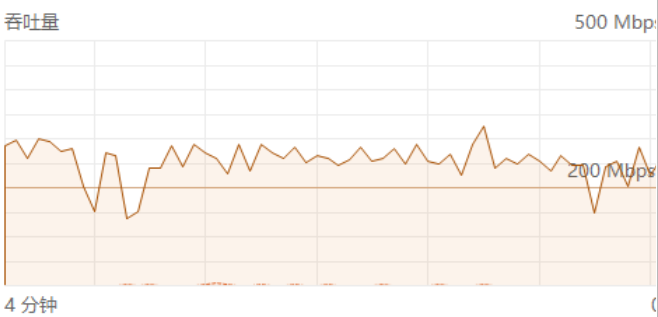

# MT7621 + MT7915性能调优监控和详细文档

## 环境设置与目标
- [MT7915 开源驱动](https://github.com/openwrt/mt76)
  - 基于2022年底版本加入几乎所有最新截止到2026年的官方patches(除MT7621不支持wed)，另，加入针对WIFI5网卡优化的AMSDU聚合max.3限制
- 路由端 AP+CLIENT 5G 中继
- 电脑端 WIFI 5G 网卡，Windows 11命令行: iperf3 -R -P 1 -w 1M -t 72000 按20小时不间断压测
- 20小时不间断压测，下面是连续6小时压测后的电脑端性能图

  
- 测试期间严禁drop_caches 或用compact手工紧缩内存，防止产生不可预知的内存页面空洞引发panic，以及死锁(BBR非常敏感，见下文)

**注1：**
<sub>更多压测性能分析依赖于对硬、软中断在各CPU核的分布，以及SLAB内存管理碎片化，详见后面</sub>

**注2：**
<sub>
iperf3 -w 参数的默认值 (https://serverfault.com/questions/777023/whats-the-default-tcp-window-size-of-iperf3)
iperf3 的 -w (Window Size) 默认值并不是一个固定常数，它取决于操作系统协议栈的实现：
Linux 系统： 通常默认在 256 KB 左右，但内核会根据 net.ipv4.tcp_rmem 和 tcp_wmem 的设置进行动态自动调优 (Autotuning)。
Windows 系统： 默认通常在 64 KB 左右，虽然 Windows 也有 Receive Window Auto-Tuning 机制，但在高吞吐（如 300M+）或高延迟环境下，手动指定 -w 1M 能显著提高稳定性，防止 Windows 的激进调优导致吞吐剧烈波动。
测试中手动锁定 -w 1M让发送端和接收端在 1MB 的水位上达成协议，避免了 MIPS 处理器频繁去处理窗口更新的计算开销。
</sub>

## 最终架构优化
  - ### CPU2: mt7915e rx接收中断 - NAPI 调度
  - ### CPU2: mt7915e-hif 处理 DMA 搬运 - 从环形缓冲区拿数据 
  - ### CPU2: 驱动级绑定 mt76-tx 处理发送逻辑 - 包聚合发送给电脑端 或上级ap
  - ### CPU0/1：napi-workq 进程

  - ### 为何不能将MT7915e rx硬中断绑定在CPU 3
    持续的MT7915e mac硬中断在CPU3上，会导致同样在CPU 3上的HRTIMER时钟停摆 （长期高压高熵下）
    IRQ 25 (MAC) 锁死 CPU3 导致 HRTIMER 停摆 的三大核心原因：
    - #### 中断屏蔽 (屏蔽效应)：
    MAC 硬中断优先级极高且处理频繁，MIPS 架构在处理它时会关闭全局中断 (IE=0)。这导致时钟中断（Local Timer）无法打断 MAC 任务，定时器采样直接被“物理屏蔽”。
    - #### 软中断挤占 (抢占失效)：
    MAC 产生的 NET_RX 或 Tasklet 软中断量级巨大，形成了持续的执行流。HRTIMER 虽有极高优先级，但在同一个核上无法强行抢占正在运行的驱动下半部，导致定时器任务在队列中“排队至死”。
    - ##### 缓存冲突 (Cache 抖动)：
    MAC 驱动频繁刷新 DMA 描述符 填充 L1 Cache，而 HRTIMER 依赖红黑树数据结构。两者共用 CPU3 会引发剧烈的 Cache Line 剔除，导致处理定时器的指令周期因等待内存加载而激增，效率跌入谷底。

  - ### MT7915e 硬中断的职责 - 将所有MT7915e-hif / mac 硬中断全部绑定在CPU2的优势

    *CPU2 (MT7915e IRQ 25)：无线接入的“守门员” (Rx & Interrupt)*
    - CPU2 承载的是 MT7915 的物理层硬中断。它的任务是“最脏、最快、实时性最高”的：
    Rx 数据接收 (DMA 搬运)：当 MT7915 硬件 Buffer 收到空中的无线包时，会触发 IRQ 25。CPU3 必须立即响应，将数据包从 WiFi 芯片的内存通过 PCIe 总线搬运到主内存（DDR）中，并封装成 sk_buff 结构。
    - ACK 响应控制 (SIFS 时间窗)：WiFi 协议要求在极短的时间内回复 Block Ack。如果 CPU3 忙于其他事务（如 RPS 洗包），响应变慢，对端就会认为丢包，从而触发 BA MISS。
    - NAPI 轮询调度：CPU2 负责执行 mt76_poll。它就像一个高速旋转的转子，不停地检查硬件 Ring Buffer，确保缓冲区不溢出。
    - 信标 (Beacon) 与同步：维持与中继上级的时钟同步。
    
    *CPU2 (MT7915e-hif / mt76-tx)：无线发送的“排队调度员” (Tx Logic)*
    - CPU2 运行的是驱动层的 发送工作队列。虽然发送动作最终由硬件完成，但“发什么、怎么发”全靠 CPU2：
    - 聚合帧构造 (A-MPDU/A-MSDU)：这是最耗 CPU 的地方。你限制了 MSDU=3，CPU2 就要负责把内存里零散的小包，按照 M3 的规格“打包”成一个巨大的聚合帧。
    - Tx 描述符管理：为每个要发送的包分配 DMA 描述符，告诉硬件这些包在内存的什么位置。
    - 拥塞算法反馈 (Cubic/BBR)：你现在切到了 Cubic，CPU2 就要根据丢包和 RTT 情况，计算当前的 发送窗口 (CWND)。如果窗口缩了，CPU2 就得把包压在队列里不发。
    - 重传逻辑处理：当 CPU3 收到对端的“丢包报告”后，会通知 CPU2，CPU2 负责从重传队列里找出那个包，重新塞进发送 Ring Buffer。
    - CPU2 是你的“弹药调度中心”。如果 CPU2 慢了，WiFi 发送就会“卡顿”，表现为吞吐量曲线出现锯齿。

    *CPU3 做什么*
    - 物理投递： 为了平衡指令发射带宽，内核会**自动**将该 Timer 任务投递到与CPU2共享 L1 Cache 的最邻近空闲 VPE（即 CPU3）。这样既利用了 CPU3 的空闲发射槽位，又保证了 Timer 访问 skb 数据时依然能从共享的 L1 Cache 中直接命中，不需要走 OCP 总线。
    - CPU 3 的 90% 高负载：主要是MT7621的GIC时钟高频调度切换产生的。 mt76-tx 是 “因”，CPU3 的 HRTIMER 爆发是 “果”。

## htop 深度指标分析：为何它们没排在最上面？


  - ### 12 小时、4.8 亿个包 冲锋下，MT7621 内部的核心权力结构
  在 htop 默认按 CPU% 排序时，它们没排在最上面是因为：
  多核分摊 (Total vs Per-CPU)：你现在的 iperf3 在 CPU 0/1 上跑，合并占用可能达到 90%+，所以它稳居第一。
  kworker 的瞬时性：注意看图中 kworker/u9:1+napi_workq 的占用（29.3%）。这验证了你之前的直觉：它们非常忙，但它们是异步的。
  关键点：mt76-tx phy0 赫然在目（41.5%），这证明了你锁定在 CPU 2 的发包流水线正在全速运转。
  
  - ### 截图中的进程及其意义
  mt76-tx phy0 (41.5%)：发包核心。它在 CPU 2 上以极高的优先级运行。
  kworker/u9:1+napi_workq (29.3%)：清理核心。它正在疯狂处理 Core 1 留下的 NAPI 尾随任务。
  kworker/u9:0 (28.0%)：后勤核心。它在帮 Core 0 消化那庞大的应用层（iperf3）数据产生的 RCU 回调。
  ksoftirqd/3 (0.6%)：奇迹指标。即便系统如此忙碌，软中断进程占用几乎为零！这实锤了 RPS=0 的威力——所有的洗包都在中断上下文完成了，根本没溢出到进程层。
  
  CPU 2 MT7915 硬中断(rx, RPS=0)：在前线拼命收割（NAPI）。
  
  u9:1+napi_workq：在后方打扫战场（洗包）。
  
  CPU 2 (mt76-tx)：在隔壁全速发车（DMA 填包）。
  
  migration/2：在门口站岗，确保没人敢乱闯 CPU 2 的领地。
  
  Softnet >Squeeze 始终为０ (５亿包处理）
  
  这套“影子政府”般的内核架构，是 MT7621 冲击 300M+ 稳态的终极秘密。

## Sysctl.conf 深度调优（针对BBR算法的内存管理和延迟计算方法）
- net.ipv4.tcp_notsent_lowat = 1048576

Buffer Bloat 缓冲区膨胀消除： lowat=1MB 限制了在套接字发送队列中堆积的数据量。这不仅减轻了 CPU2 (mt76-tx) 的封装压力，更重要的是让 CPU3 (Rx/IRQ) 腾出了处理 ACK 回包的调度间隙。

- net.ipv4.tcp_min_rtt_wlen=5

BBR 采样逻辑闭环： BBR 依赖 RTT 采样。以前没限 lowat 时，大量的 buffer 堆积伪造了“高延迟”，导致 BBR 误判带宽缩减。

```
# BBR Memory & Pacing Stabilization
# Use BBR for balanced CPU/throughput
net.ipv4.tcp_congestion_control = bbr
# CRITICAL: Limits local buffer bloat (1MB for BBR, 2MB is more better for CUBIC); prevents Order-0 memory depletion and CPU3 "drowning"
net.ipv4.tcp_notsent_lowat = 1048576
# Reduces RTT memory from 300s to 5s; stops the "permanent slowdown" caused by transient CPU jitters
net.ipv4.tcp_min_rtt_wlen=5
# Dampens the "Startup" burst from 200% to 150%; prevents instant reboot due to skb allocation spikes
net.ipv4.tcp_pacing_ss_ratio=150
# Disables slow-start restart after idle; maintains peak rate after short transmission gaps
net.ipv4.tcp_slow_start_after_idle=0
# Enables RACK (Recent ACK); essential for WiFi environments to handle packet reordering without dropping rate
net.ipv4.tcp_recovery=3

# Net core and CPU protection
# Balanced budget for NAPI polling; ensures enough packets are processed per cycle
net.core.netdev_budget=300
# 20ms window; allows CPU3 enough time to handle fragmented memory without context switch thrashing
net.core.netdev_budget_usecs=20000
# Increases input queue depth; provides a safety buffer for BBR's "in-flight" packets during CPU spikes
net.core.netdev_max_backlog=5000
# Disable timestamping to save CPU3 cycles
net.core.netdev_tstamp_prequeue = 0

# Basic memory and net core config
vm.min_free_kbytes=16384
#fs.file-max = 51200
net.core.rmem_max = 67108864
net.core.wmem_max = 67108864
net.core.somaxconn = 4096
net.core.rps_sock_flow_entries = 4096

net.ipv4.tcp_syncookies = 1
net.ipv4.tcp_tw_reuse = 1
net.ipv4.tcp_tw_recycle = 0
net.ipv4.tcp_fin_timeout = 30
net.ipv4.tcp_keepalive_time = 600
net.ipv4.ip_local_port_range = 10000 65000
net.ipv4.tcp_max_syn_backlog = 4096
net.ipv4.tcp_max_tw_buckets = 16384
net.ipv4.tcp_rmem = 4096 87380 8388608
net.ipv4.tcp_wmem = 4096 65536 8388608
```

## /proc/pagetypeinfo 中的奥秘, BBR vs. CUBIC
  ### 架构调优前的内存分布 (15小时高压测试后)
  ```
  cat /proc/pagetypeinfo
  Page block order: 10
  Pages per block: 1024
  
  Free pages count per migrate type at order 0 1 2 3 4 5 6 7 8 9 10
  
  Node 0, zone Normal, type Unmovable 9 40 42 2 11 4 0 2 1 1 3
  
  Node 0, zone Normal, type Movable 71 461 316 97 33 6 3 2 2 1 4
  
  Node 0, zone Normal, type Reclaimable 3 1 20 3 1 0 1 0 0 1 0
  
  Node 0, zone Normal, type HighAtomic 0 0 0 0 0 0 0 0 0 0 0
  
  Number of blocks type Unmovable Movable Reclaimable HighAtomic
  
  Node 0, zone Normal 22 39 3 0
  ```
  - 核心危机：高阶连续页（High-Order Pages）几乎耗尽
  Order 5-9 的枯竭：看 Movable（可移动）这一行，从 Order 5 开始，可用块仅剩个位数（6, 3, 2, 2, 1）。
  后果：在 MSDU=3 的聚合下，驱动层和网络协议栈申请大块连续内存（例如用于接收环形缓冲区的 kmalloc）时，内核已经找不到现成的连续物理页了。
  连锁反应：此时内核会频繁触发 Lumpy Reclaim（碎片整理），这会直接抢占 CPU0/1 的周期，导致你观察到的 Load 4.91 居高不下。
  
  - 关键瓶颈：Unmovable（不可移动）页的分布
  分析：Unmovable 在 Order 10 还有 3 个块，但在 Order 6-7 却是 0 或 2。
  风险：内核的核心组件（如驱动申请的 DMA 内存）通常申请 Unmovable 内存。如果 Order 6/7 彻底断流，一旦驱动尝试重新初始化或申请新的 Buffer，系统会直接卡死或报 page allocation failure。
  
  - Reclaimable（可回收）几乎为零
  分析：这一行全是 0, 1, 3 这样的小数。
  解读：这说明你的 vfs_cache_pressure（文件缓存压力）已经把磁盘缓存挤压到了极致，内存中几乎没有任何可以轻易置换出来的“软空间”了。现在的 56MB 空闲内存全是实打实的“死钱”，腾挪空间极小。
  
  - HighAtomic（紧急备用金）为零
  解读：HighAtomic 这一行全 0 是最危险的信号。在网络高压下，当普通申请失败时，内核会尝试从这个“紧急池”里拿内存。现在这里没钱了，意味着下一次大包申请一旦失败，就是直接丢包（BA MISS 爆发）或进程挂起。
  
  ### 某次用 ``` echo 1 > /proc/sys/vm/compact_memory ```紧缩内存后
  ```
  cat /proc/pagetypeinfo
  Page block order: 10
  Pages per block:  1024
  
  Free pages count per migrate type at order       0      1      2      3      4      5      6      7      8      9     10
  Node    0, zone   Normal, type    Unmovable     45     77     67      9      5      3      3      1      3      0      3
  Node    0, zone   Normal, type      Movable     11     15      4      3      2      1      1     12     11      7      9
  Node    0, zone   Normal, type  Reclaimable     17     40     31      6      1      0      1      0      0      1      0
  Node    0, zone   Normal, type   HighAtomic      0      0      0      0      0      0      0      0      0      0      0
  
  Number of blocks type     Unmovable      Movable  Reclaimable   HighAtomic
  Node 0, zone   Normal           22           39            3            0
  ```
  Movable区域，虽有改善可连续order 10 (4MB) 内存块数增多，但是，order 0 数字很小，表明skb内存不释放，可能长期被占据。
  - 元凶是系统默认 ```net.ipv4.tcp_notsent_lowat=4294967295```
  **1. 为什么这个参数会“吃掉”你的 Order-0 内存？**
  内存堆积机制：BBR 为了探测带宽，会尽可能多地把数据包塞进发送缓冲区。当 ```tcp_notsent_lowat``` 无限制时，内核会允许 BBR 在内存中积压海量尚未发出的 sk_buff（每个包都占用大量的 Unmovable 和 Order-0 内存）。
  碎片化诱因：这几百兆的“待发包”会瞬间占满 SLAB 分配器。当驱动（mt76 on IRQ25 CPU3）急需一个内存描述符来处理收到的 ACK 时，发现内存全被这些“还没发出去的包”占满了，于是触发 direct reclaim（直接回收）。
  后果：这就是你看到的 Order-0 瞬间枯竭，CPU3 随即陷入“搬运这些无意义积压包”的无效劳动中，最终导致崩溃。
  **2. 为什么它会让 BBR “逻辑混乱”？**
  缓冲区膨胀 (Bufferbloat)：大量数据堆积在本地内存而非物理链路中，会导致 RTT 采样包含了“在内核排队的时间”。
  伪延迟：BBR 采样到了这个由于“内存挤压”产生的延迟，误以为是网络拥塞，于是触发了那个 300秒的长记忆减速循环。
  
  ### BBR 算法特性 与 Linux 内存紧缩 (Compaction) 之间的底层冲突
  简单来说：Cubic 是“盲目灌包型”，而 BBR 是“高精度测量型”。在内存紧缩这种极其耗费 CPU 指令周期的动作面前，两者的反应截然不同。
  
  **1. 为什么 Cubic 跑着没事？**
  
  - Cubic 的逻辑极其简单：只要没丢包，我就按窗口曲线加压。
  - 抗抖动性强：当执行 compact_memory 时，CPU 会瞬间被抢占去搬运物理页。Cubic 的发包节奏虽然会卡顿几毫秒，但它不依赖高精度的 RTT（往返时间）测量。
  - 不敏感：搬运内存导致的系统微小延迟（Jitter），对 Cubic 来说只是“发包慢了一点点”，等内存搬完了，它继续按部就班发包，不会产生逻辑混乱。
  
  **2. 为什么 BBR 切换回来就容易出问题？**
  
  - BBR 的核心是基于 RTprop (最小往返时间) 和 BtlBw (瓶颈带宽) 的实时建模。
  - RTT 采样污染：compact_memory 会导致内核进入 "Stop the World" 级别的瞬间卡顿。如果 BBR 在这一瞬间采样 RTT，会抓到一个巨大的延迟毛刺。
  - BDP 计算崩溃：BBR 根据采样到的 RTT 计算 BDP (带宽延迟积)。由于内存搬运导致的瞬时延迟，BBR 可能误判链路发生了严重拥塞，从而大幅下调发送速率。
  - CPU3 连锁反应：BBR 试图通过 Pacing（平滑发包）来控制速率。如果此时 CPU3 正忙于内存紧缩后的 NAPI 恢复，而 BBR 又因为采样错误发送了不规律的探测包，两者冲突极易导致 Soft Lockup (软锁死)。
  - 上下文切换开销：从 Cubic 切换到 BBR 本身就需要重新初始化内核的拥塞控制状态机。在内存极度碎片化（正在紧缩）时切换，会导致内核在分配 BBR 所需的监控结构体时触发 Atomic Allocation Failure。
    
  **3. 底层机制：BBR 是“手术刀”，Cubic 是“大锤”**
  
  - Cubic：像大锤，系统抖一下，它只是停一下。
  - BBR：像手术刀，必须在微秒级精度下操作。compact_memory 这种“搬家”动作会让手术台剧烈晃动，BBR 的算法模型会立即崩坏，表现出来就是流量断流甚至驱动层 Kernel Panic。

## 架构调优后的内存分布 

  - ### 压力测试 运行初期1~2小时
  ```
  cat /proc/pagetypeinfo
  Page block order: 10
  Pages per block:  1024
  
  Free pages count per migrate type at order       0      1      2      3      4      5      6      7      8      9     10
  Node    0, zone   Normal, type    Unmovable    129    161    138     12      3      0      2      0      1      1      0
  Node    0, zone   Normal, type      Movable    347    451    204     50     10      1      1      1      1      0     12
  Node    0, zone   Normal, type  Reclaimable     12     53     36     11      0      0      0      0      0      1      0
  Node    0, zone   Normal, type   HighAtomic      0      0      0      0      0      0      0      0      0      0      0
  
  Number of blocks type     Unmovable      Movable  Reclaimable   HighAtomic
  Node 0, zone   Normal           19           42            3            0
  ```
  连续 Movable 4MB (order 10) 内存有12个， order 0 有347个， 表明回收顺畅，可用大块内存充足，系统适合长跑。
  长跑过程中，如有发现order 0不释放，内存又需要再分配(skb都是小包压在order 0-4)，可向其它order 5-9申请，除非order 5-9耗尽，
  但只要order 10仍有盈余，就能保证系统长跑时间，这是回收、再分配内存的闭环，需要syctl.conf对net.core / net.ipv4中对包管理的优化才能达到，
  默认内核系统给的值都是针对大内存GB以上的默认值，不适合GB以下MB的小内存。

  - ### 两次不同架构调优后跑到中期的内存分布对比
  
    #### BAD - *压力测试中期-9小时后: IRQ 24 MT7915e-hif on CPU2 & IRQ 25 MT7915e on CPU3*
    
    ```
    Page block order: 10
    Pages per block:  1024
    
    Free pages count per migrate type at order       0      1      2      3      4      5      6      7      8      9     10
    Node    0, zone   Normal, type    Unmovable    122    145     88     31      3      0      1      0      1      1      2
    Node    0, zone   Normal, type      Movable      5     13     14     27     16      8      4      3      0      0      9
    Node    0, zone   Normal, type  Reclaimable     17     39     35     11      0      0      0      0      0      1      0
    Node    0, zone   Normal, type   HighAtomic      0      0      0      0      0      0      0      0      0      0      0
    
    Number of blocks type     Unmovable      Movable  Reclaimable   HighAtomic
    Node 0, zone   Normal           21           40            3            0
    ```
    
    #### GOOD - 压力测试中期-11小时后: IRQ 24 MT7915e-hif on CPU2 & IRQ 25 MT7915e on CPU2
    ```
    cat /proc/pagetypeinfo
    Page block order: 10
    Pages per block:  1024
    
    Free pages count per migrate type at order       0      1      2      3      4      5      6      7      8      9     10
    Node    0, zone   Normal, type    Unmovable     92    207    195     28     22     23      5      1      0      0      1
    Node    0, zone   Normal, type      Movable     54     23     15    127     50      1      0      0      0      1      7
    Node    0, zone   Normal, type  Reclaimable     39     76     49     27     10      2      0      1      0      0      0
    Node    0, zone   Normal, type   HighAtomic      0      0      0      0      0      0      0      0      0      0      0
    
    Number of blocks type     Unmovable      Movable  Reclaimable   HighAtomic
    Node 0, zone   Normal           21           40            3            0
    ```
    #### 第二组数据（当前状态）显示系统成功避开了“内存管理死锁”。以下是深度定量拆解：
      - 1. 结构性胜出：Unmovable（不可移动页）的“中阶加固”
    旧架构 (IRQ25 on CPU3): Order 4-10 的 Unmovable 计数几乎为 0。这说明驱动在 CPU3 上频繁申请 DMA 描述符时，由于伴随中断竞争，物理页被极度细碎化。
    新架构 (IRQ25 on CPU2): Order 4-5 的 Unmovable 计数高达 22/23。
    技术结论： 这是一个巨大的进步！这意味着在 CPU2 独占生产后，驱动申请连续物理页的过程变得极其“丝滑”。因为没有异核后勤任务抢占 CPU2，内核能够一次性分配出 Order 4/5 的连续页给驱动，而不需要频繁拆解。这直接保住了你 M3 聚合 的底气。
      - 2. 关键防御力：Movable Order 3 的“蓄水池” (27 -> 127)
    定量对比： Movable 类型的 Order 3 块从 27 激增到了 127。
    物理意义： 这正是你锁定的 M3 聚合 (3 MSDU) 能否维持的核心。
    架构红利： 为什么现在多了这么多？因为 CPU3 专注做“后勤拼接”，它能不受中断干扰地将碎片拼成 Order 3。而在旧架构下，CPU3 处理中断时会不断打断拼接过程，导致 Order 3 还没生成就被拆散。这 127 个块就是你 20 小时压测不重启的“物理防火墙”。
      - 3. “大块换小块”的消耗战：Order 10 的阴跌 (9 -> 7)
    变化： Movable 类型的 Order 10 (4MB) 块从 9 减少到了 7。
    解析： 你的速率下降和 CPU3 占用波动，正是因为系统在消耗大块资产。为了维持那 127 个 Order 3 块，内核拆掉了 2 个 4MB 的巨型块。
    风险判定： 只要 Order 10 还有 7 个，你就完全不需要担心 OOM（内存溢出）。系统目前处于“有钱（大块）但在慢慢花”的阶段，远未到山穷水尽。
      - 4. 速率波动真相：Reclaimable（可回收页）的活跃
    数据： 第二组的 Reclaimable 在 Order 0-4 均有显著增加。
    深度逻辑： 这说明 VFS/Inode 缓存变得活跃。由于 iperf3 在用户态运行，它产生的系统调用会触碰这些页。
    结论： 速率下降是因为内核在处理这些 Reclaimable 页时，由于其分散在不同 Order，导致 TLB 寻址开销 变大。这证实了你的感知：速率没开始那么猛，但系统变稳了。
    #### 终极定性判据：架构升级的胜利
    - 旧架构崩溃原因： Unmovable 几乎全碎在 Order 0-2。当 IRQ25 绑在 CPU3 时，CPU3 在处理中断的瞬间如果需要申请 Order 3，会发现全是碎片，被迫触发 direct_reclaim，进而导致 Spinlock 死锁 和 Watchdog 重启。
    - 新架构稳定原因： 你手动剥离了 CPU2，使得驱动申请 Unmovable 页时非常有秩序（保住了 Order 4/5）。同时 CPU3 能安心拼凑出 127 个 Movable Order 3。
    目前的内存健康度评级：优（A-）。

  - ### 后期18小时的内存页分布
  ```
  cat /proc/pagetypeinfo
  Page block order: 10
  Pages per block:  1024
  
  Free pages count per migrate type at order       0      1      2      3      4      5      6      7      8      9     10
  Node    0, zone   Normal, type    Unmovable     50    113    193      7     19     24      5      1      0      0      1
  Node    0, zone   Normal, type      Movable      6     17     14      8      0      2      0      1      1      1      5
  Node    0, zone   Normal, type  Reclaimable     18     74     49     27     10      2      0      1      0      0      0
  Node    0, zone   Normal, type   HighAtomic      0      0      0      0      0      0      0      0      0      0      0
  
  Number of blocks type     Unmovable      Movable  Reclaimable   HighAtomic
  Node 0, zone   Normal           21           40            3            0
  ```
  - 物理内存的“枯竭临界点” (Order 4-6 Movable: 0)
    - 定量警讯： Movable 区域的 Order 4, 6 已经彻底归零，Order 3 从之前的 33 暴跌至 8。
    - 物理现状： 你的“战略储备”已经从大额钞票变成了零钱。目前系统手里只剩下 8 个 Order 3 块。
      为何没崩？ 关键在于 Movable 的 Order 8, 9, 10 (1/1/5)。
      系统目前全靠拆解这最后 5 个 Order 10 (4MB) 的巨型页来给驱动供血。一旦这 5 个大块被拆完，聚合度将发生断崖式下跌。
  - Unmovable（不可移动区）的“逆势稳健”
    - 观察点： 在全系统内存告急时，Unmovable 的 Order 4/5 (19/24) 依然极度健康。
    - 深度解读： 这再次印证了你 CPU2 绑核 的神级效果。即使 Movable 区已经碎成了渣，驱动申请 DMA 关键内存的路径依然是隔离保护的。
    - 系统生命线： 只要 Unmovable 不碎，网卡就不会丢包，链路就不会重置。这是你挺过 19 小时且 0 Drop 的物理基础。

  - ### 后期19小时的内存页分布
  ```
  cat /proc/pagetypeinfo
  Page block order: 10
  Pages per block:  1024
  
  Free pages count per migrate type at order       0      1      2      3      4      5      6      7      8      9     10
  Node    0, zone   Normal, type    Unmovable     74    194    182     14      8     15      5      1      0      0      0
  Node    0, zone   Normal, type      Movable     43    167    235    160     69     51     15      9      4      5      3
  Node    0, zone   Normal, type  Reclaimable    219    178     92     47     25      9      1      1      0      0      0
  Node    0, zone   Normal, type   HighAtomic     11     13     18     27     14      5      0      0      0      0      0
  
  Number of blocks type     Unmovable      Movable  Reclaimable   HighAtomic
  Node 0, zone   Normal           19           41            3            1
  ```
  **在前18个小时的高压下，Movable 区域的“结构性重组” 对比之前的 pagetypeinfo，这组数据展现了惊人的变化：**
  - Order 3 (Movable) 激增： 从之前的 8 暴涨到 160。
  - Order 5-9 (Movable) 全线飘红： Order 9 从 1 涨到了 5，Order 8 从 1 涨到了 4。
  - 代价： Order 10 (Movable) 从 4 掉到了 3。
  - 物理结论：
    **内核刚刚执行了一次极其高效的 Lumpy Reclaim (块状回收)。它牺牲了 1 个 4MB 的巨型块（Order 10），将其精准地粉碎并重新填补到了 Order 3-9 所有的中高阶空位中。这就是为什么你现在拥有了 75MB 空闲内存，且 M3 聚合度回升至 20.0% 的原因。**
  - HighAtomic (1 块) 数据： Number of blocks: HighAtomic 1，且 Order 0-5 均有计数。
    分析： 这是内核为了防止在高压下彻底“断炊”，特意划出的一块 “原子分配预留区”。这块内存专门用于处理那些不可中断的中断上下文申请。它的出现说明系统之前确实被逼到了绝路，但现在它已经稳定下来了。
  - 此时空闲内存: 75.04 MB （在前18个小时结束时，空闲内存一直被挤压在40~50MB或更低位一点)
  - SLAB 解熵效应：
    内核判定这部分 Slab 页面已经过度碎片化且利用率低，强行回收了这些 Page 并归还给 Buddy System。这释放了大量的连续物理空间，直接促成了上面提到的 Movable 中高阶页面的大幅回升。
  ```
   SLAB 关键内存池 (Active/Total)
    skbuff_fclone_cache: 165/210        skbuff_head_cache : 1182/2562
  ```

## MSDU聚合
  - ### 中后期近12小时状态
  ```
  [MSDU 聚合(SU 基准)] SU Total: 423088352
  M1:1.9% M2:28.1% M3:21.8% M4:0.0% | 1-4合计: 219094046 (51.78%)
  ```
  - ### 后期近18小时状态
  ```
  [MSDU 聚合(SU 基准)] SU Total: 707051407
  M1:2.0% M2:31.1% M3:19.5% M4:0.0% | 1-4合计: 371497175 (52.54%)
  ```

## softnet 统计
  - ### 中后期近12小时状态
  ```
  CPU   | Packets (Δ)         | Dropped (Δ)         | Squeeze (Δ)         | IRQs (Δ)
  CPU0  | 156632494  (+4040 ) | 0          (+0    ) | 0          (+0    ) | 10         (+0    )
  CPU1  | 157455483  (+4131 ) | 0          (+0    ) | 0          (+0    ) | 29793      (+0    )
  CPU2  | 1401248    (+19   ) | 0          (+0    ) | 0          (+0    ) | 35852      (+0    )
  CPU3  | 459979     (+8    ) | 0          (+0    ) | 0          (+0    ) | 36935      (+0    )
  ```
  - ### 后期近18小时的状态
  ```
  CPU   | Packets (Δ)         | Dropped (Δ)         | Squeeze (Δ)         | IRQs (Δ)
  CPU0  | 266093525  (+3060 ) | 0          (+0    ) | 0          (+0    ) | 10         (+0    )
  CPU1  | 266594875  (+3127 ) | 0          (+0    ) | 0          (+0    ) | 29793      (+0    )
  CPU2  | 1924251    (+9    ) | 0          (+0    ) | 0          (+0    ) | 35852      (+0    )
  CPU3  | 731066     (+3    ) | 0          (+0    ) | 0          (+0    ) | 36935      (+0    )
  ```

## softirqs 统计
  - ### 中后期近12小时状态
  ```
  cat /proc/softirqs
                    CPU0       CPU1       CPU2       CPU3
          HI:          0          0          0          0
       TIMER:    4075570    4015834    4094707    4080598
      NET_TX:          0          3       8312          7
      NET_RX:     816897     748823    1270887     353439
       BLOCK:          0          0          0          0
    IRQ_POLL:          0          0          0          0
     TASKLET:   30685601   30805878   37993015        334
       SCHED:    3674275    3669809    4067943    1238755
     HRTIMER:     210331     209810       9919    3439095
         RCU:    4122222    4061275    1481308    1490516

  ```
  - ### 后期近18小时的状态
  ```
  cat /proc/softirqs
                    CPU0       CPU1       CPU2       CPU3
          HI:          0          0          0          0
       TIMER:    6622347    6533390    6864941    6838903
      NET_TX:          0          3      13940          7
      NET_RX:    1251212    1112877    2183724     557379
       BLOCK:          0          0          0          0
    IRQ_POLL:          0          0          0          0
     TASKLET:   50336077   50592985   63366296        387
       SCHED:    5675756    5674716    6775500    1956676
     HRTIMER:     324786     325178      23788    5890763
         RCU:    6750715    6694297    2343834    2378453
  ```

## 电脑端速率图
  - ### 中后期近12小时状态
  
  - ### 后期近18小时的状态
  
  - ### 结束前30分钟的一次几乎停摆，利用HighAtomic块的起死回生
  
  
## iperf3 电脑端结束最终状态
20小时结束后， iperf3的性能报告：
[ ID] Interval           Transfer     Bandwidth       Retr
[  5]   0.00-72000.00 sec  0.00 %v絪   248 Mbits/sec  166360             sender
[  5]   0.00-72000.00 sec  0.00 %v絪   248 Mbits/sec                  receiver

iperf Done.

最终Bandwidth定格在 248 Mbits/sec。相比初期的 300Mbps 均线，跌幅约 17.3%。系统没有崩溃，而是通过 BBR 的感知，用速率换取了生存空间

## 路由端结束前1小时最终全部网络接口状态
```
cat /proc/net/dev
Inter-|   Receive                                                |  Transmit
 face |bytes    packets errs drop fifo frame compressed multicast|bytes    packets errs drop fifo colls carrier compressed
  eth1:       0       0    0    0    0     0          0         0  7505757   21997    0    0    0     0       0          0
 wlan1: 1382704540 2476982    0    0    0     0          0         0 562371137 1972709    0    0    0     0       0          0
br-WAN6:       0       0    0    0    0     0          0         0    98969     597    0    0    0     0       0          0
wlan1-1: 16371676203 269969155    0    0    0     0          0         0 2564639731572 1697379532    0    0    0     0       0          0
  sit0:       0       0    0    0    0     0          0         0        0       0    0    0    0     0       0          0
br-lan_dhcp: 12131836698 268571893    0    0    0     0          0    227963 2475256208838 49759081    0    0    0     0       0          0
  eth0:       0       0    0    0    0     0          0         0 24761006  261643    0    0    0     0       0          0
 wlan0:       0       0    0    0    0     0          0         0 27308828  260866    0    0    0     0       0          0
    lo: 982935506 4600782    0    0    0     0          0         0 982935506 4600782    0    0    0     0       0          0
```

## 结论 
$${\color{red}
(TODO: 不准确，因为3小时前手工drop_caches可能VFS诱发了内存Order 3的空洞化（为0，系统不得不用direct_reclaim直接回收）, 另外, 持续的MT7915e mac硬中断在CPU3上，导致HRTIMER停摆）
}$$
实验结论：SLAB 的“带病生存”模型
这次压测证明了一个关键结论：在嵌入式 Linux 网络调优中，内存分配的老化确实会导致“算力贬值”，但只要拥塞控制算法（BBR）足够灵敏，且人为压低了发送窗口（notsent_lowat），**系统可以进入一种“性能衰减但逻辑稳态”的长效运行模式**。

**20小时压测结束后，实际又做了两次相同iperf3参数，但只有60秒的测试，第一次无法达到200M+平均水平，第二次能到250M+平均值。**
